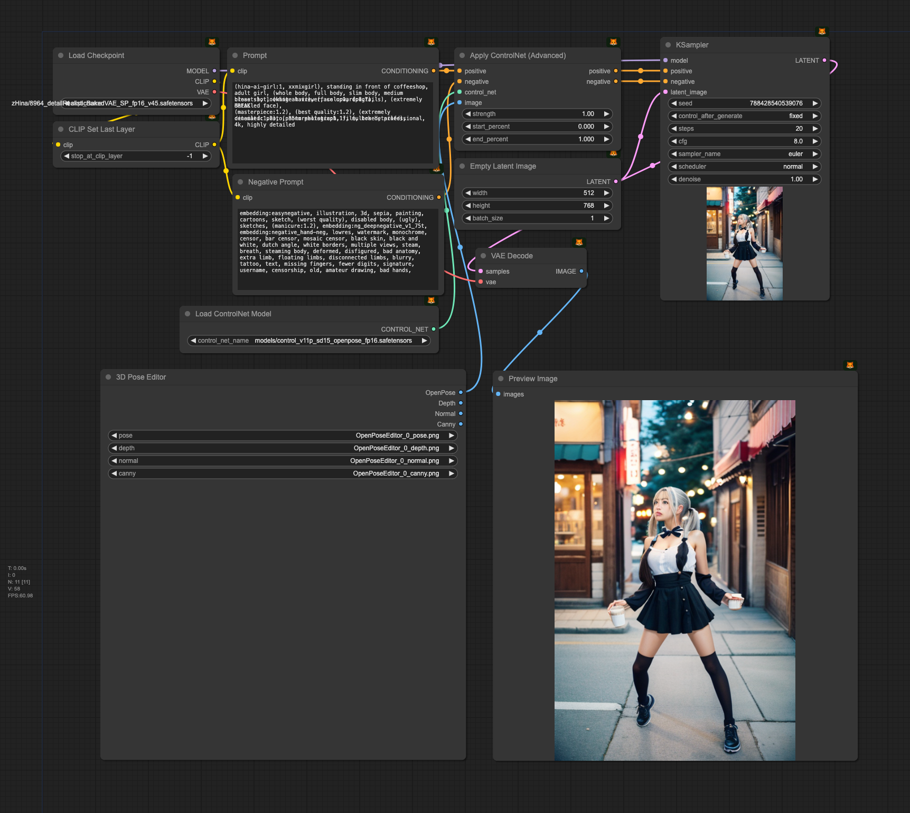

# ComfyUI 3D Pose Editor

Custom nodes that extend the capabilities of [ComfyUI](https://github.com/comfyanonymous/ComfyUI)

# Editor Source
[open-pose-editor](https://github.com/ZhUyU1997/open-pose-editor)

## Update

2024.01.04 Rewrite all the load method, fixed issue [#1](https://github.com/hinablue/ComfyUI_3dPoseEditor/issues/1), [#2](https://github.com/hinablue/ComfyUI_3dPoseEditor/issues/2), [#4](https://github.com/hinablue/ComfyUI_3dPoseEditor/issues/4), very thanks [@ltdrdata](https://github.com/ltdrdata)

---

# List Nodes

| Name                               |                                                     Description                                                     |     ComfyUI category      |
| :--------------------------------- | :-----------------------------------------------------------------------------------------------------------------: | :-----------------------: |
| _3D Pose Editor_                         |                                            The node set pose ControlNet                                             |    `image/3D Pose Editor`     |

# Usage

Just drag. If your ComfyUI interface is not responding, try to reload your browser.

## ~~Window Portable Issue~~

~~If you are using the Windows portable version and are experiencing problems with the installation, please create the following folder manually.~~

## Efficient Nodes KSampler Issue

When using the same feed in the Efficient KSampler output will be not change if pose editor changed (maybe KSampler cached?).

## Sample workflow

Just download this PNG and drop into your ComfyUI.
